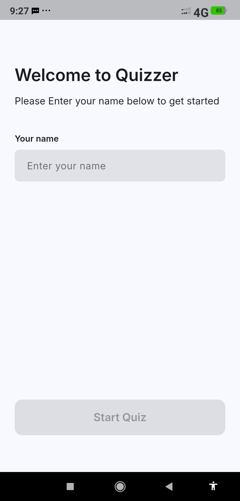
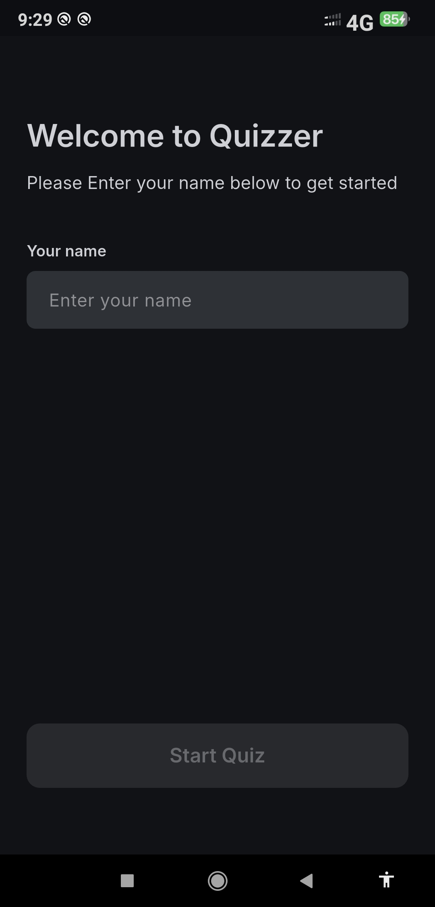
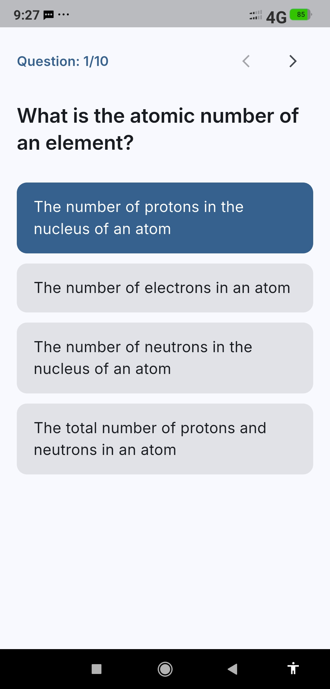
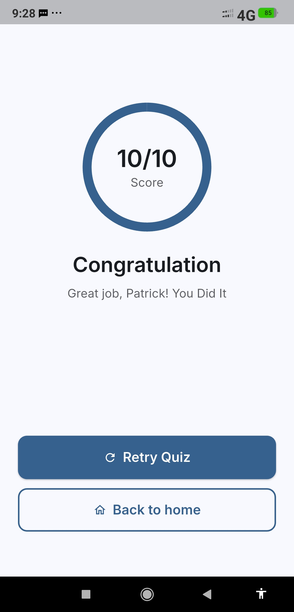
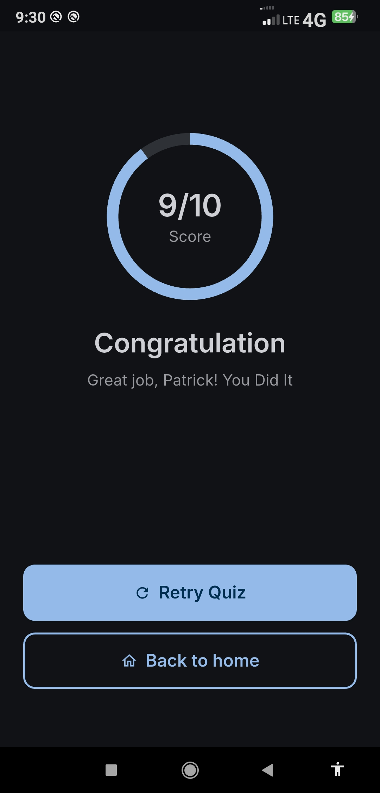

# Quizzer

Aplikasi kuis sederhana yang dibuat dengan Flutter.

## Informasi Mahasiswa

- **Nama:** Patrick Nathan Wangsa
- **NIM:** 231401071
- **KOM:** KOM-B

## Tentang Aplikasi (Deskripsi)

**Quizzer** adalah aplikasi kuis sederhana yang dibuat dengan Flutter. Aplikasi ini dirancang untuk menguji pengetahuan pengguna melalui serangkaian pertanyaan pilihan ganda. Pengguna memasukkan nama mereka, menyelesaikan kuis, dan mendapatkan skor akhir. Aplikasi ini dibuat sebagai proyek [Tujuan Proyek, misal: Ujian Tengah Semester (UTS)].

## Fitur

* **Splash Screen:** Tampilan pembuka aplikasi selama 3 detik.
* **Validasi Nama Pengguna:** Pengguna harus memasukkan nama sebelum dapat memulai kuis.
* **Pertanyaan Acak:** Urutan pertanyaan diacak setiap kali sesi kuis baru dimulai.
* **Pilihan Jawaban Acak:** Urutan pilihan jawaban (opsi) untuk setiap pertanyaan juga diacak.
* **Navigasi Kuis:** Pengguna dapat menavigasi ke pertanyaan selanjutnya atau kembali ke pertanyaan sebelumnya.
* **Light and Dark Theme:** Tema aplikasi (terang dan gelap) beradaptasi secara otomatis mengikuti pengaturan sistem perangkat, dengan skema warna kustom untuk *dark mode*.
* **Retry Quiz:** Pengguna dapat mengulang kuis langsung dari halaman hasil.

## Screenshot Aplikasi

### 1. Home Screen (Input Nama)



### 2. Quiz Screen



### 3. Result Screen (dengan Animasi)




### Video Demo
[**Lihat Video Demo Lengkap (MP4)**](docs/demo.mp4)

## Link Mockup/Prototype

- **Aplikasi Web:** [Prototype Quizzer] (https://www.figma.com/proto/eNomXgDzH5GLPrQ7Zr9Rt4/Quizzer?node-id=0-1&t=La5dALbc0swb8pZn-1)]

## Credit Aset
* **Figma:** [Figma](https://www.figma.com/design/eNomXgDzH5GLPrQ7Zr9Rt4/Quizzer?node-id=0-1&m=dev&t=La5dALbc0swb8pZn-1)
* **Font:** [Inter](https://fonts.google.com/specimen/Inter)
* Seluruh aset lain (ikon, dll.) adalah bagian dari Flutter SDK.

## Struktur Proyek

```
lib/
│
├── data/
│   └── questions.dart         # List-list pertanyaan 
│
├── models/
│   └── quiz_model.dart        # Getter dan setter untuk pertanyaan
│
├── screens/
│   ├── home_screen.dart       # Halaman Screen awal
│   ├── quiz_screen.dart       # Halaman Kuis
│   ├── result_screen.dart     # Halaman Hasil
│   └── splash_screen.dart     # Splash Screen gimmick
│
├── widgets/
│   └── option_tile.dart       # Widget untuk pilihan jawaban
│
├── app.dart                   # Setting Utama Aplikasi
├── main.dart                  # File menjalankan  Aplikasi
├── routes.dart                # Routing Halaman Aplikasi
└── theme.dart                 # Theme (warna) aplikasi untuk light dan dark
```